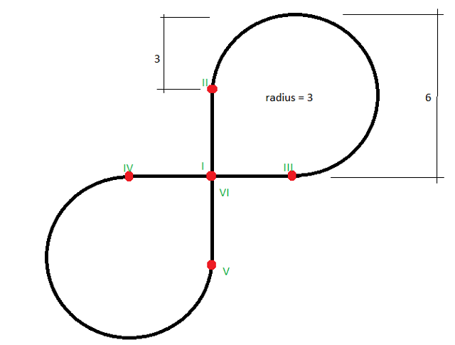
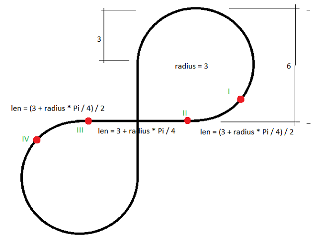
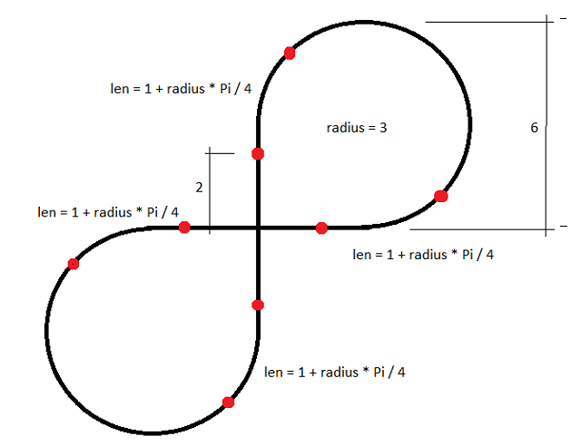
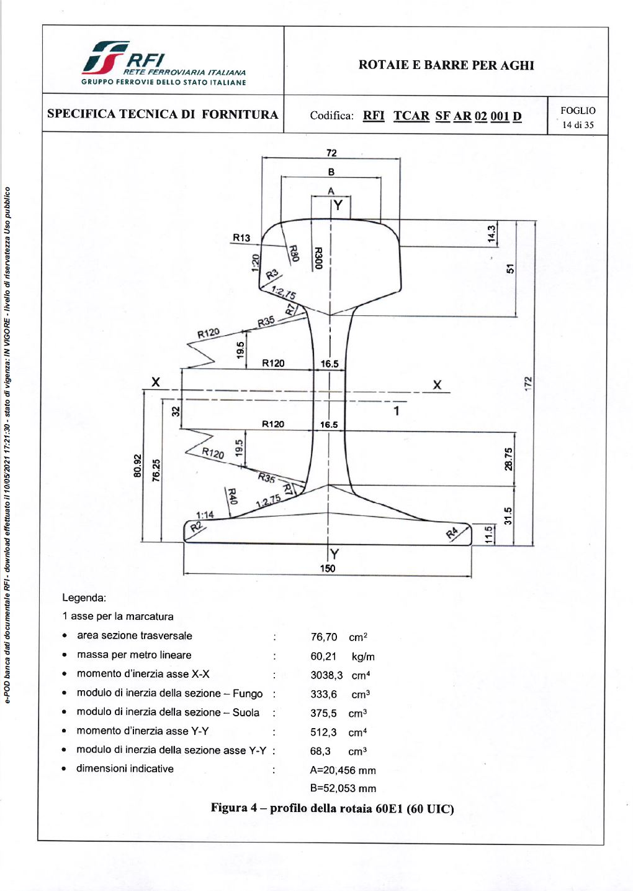
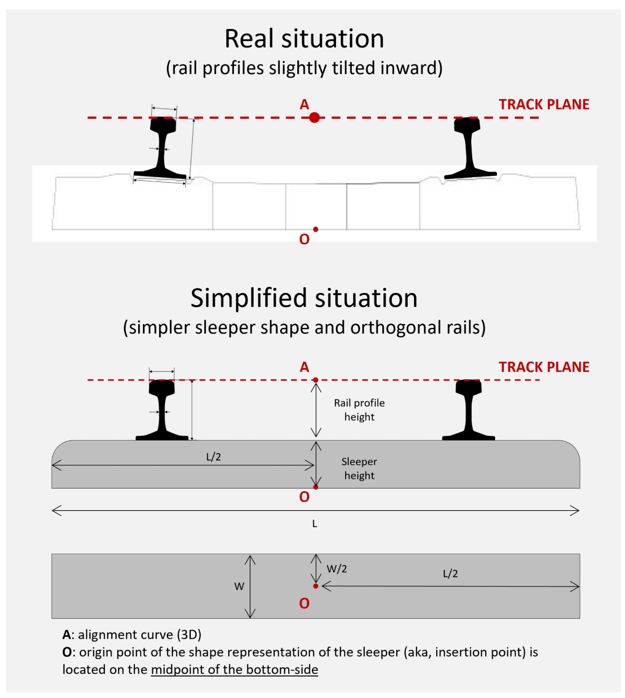

## Variations
The following occurrence variations need to be checked and certified in relation to the targeted entities and concept templates:

- Entity_01 - *decription of variation*
- Entity_02 - *decription of variation*

## Model Dataset
This test case utilises the attached dataset documented by the following drawings and data schedule. 

Horizontal Alignment

| Name | Type                          | StartPointX | StartPointY | StartDirection | StartRadius | EndRadius | Length      | Type_1       |   |
|------|-------------------------------|-------------|-------------|----------------|-------------|-----------|-------------|--------------|---|
| H1   | IfcAlignmentHorizontalSegment | 0           | 0           | 1.570796327    | 0           | 0         | 3000        | LINE         |   |
| H2   | IfcAlignmentHorizontalSegment | 0           | 3000        | 1.570796327    | -3000       | -3000     | 14137.16694 | CIRCULARARC  |   |
| H3   | IfcAlignmentHorizontalSegment | 3000        | 0           | 3.141592654    | 0           | 0         | 6000        | LINE         |   |
| H4   | IfcAlignmentHorizontalSegment | -3000       | 0           | 3.141592654    | 3000        | 3000      | 14137.16694 | CIRCULARARC  |   |
| H5   | IfcAlignmentHorizontalSegment | 0           | -3000       | 1.570796327    | 0           | 0         | 3000        | LINE         |   |

Vertical Alignment

| Name | Type                        | StartDistAlong | HorizontalLength | StartHeight | StartGradient | EndGradient | Radius | Type_1            |   |
|------|-----------------------------|----------------|------------------|-------------|---------------|-------------|--------|-------------------|---|
| V1   | IfcAlignmentVerticalSegment | 0              | 14780.97245      | 100         | 0             | 0           | 0      | CONSTANTGRADIENT  |   |
| V2   | IfcAlignmentVerticalSegment | 14780.97245    | 2678.097245      | 100         | 0             | 0.7         | 3000   | CIRCULARARC       |   |
| V3   | IfcAlignmentVerticalSegment | 17459.0697     | 5356.19449       | 944.195788  | 0.7           | -0.7        | 3000   | CIRCULARARC       |   |
| V4   | IfcAlignmentVerticalSegment | 22815.26419    | 2678.097245      | 944.195788  | -0.7          | 0           | 3000   | CIRCULARARC       |   |
| V5   | IfcAlignmentVerticalSegment | 25493.36143    | 14780.97245      | 100         | 0             | 0           | 0      | CONSTANTGRADIENT  |   |

Cant Alignment

| Name | Type                    | StartDistAlong | HorizontalLength | StartCantLeft | EndCantLeft | StartCantRight | EndCantRight | Type_1            |   |
|------|-------------------------|----------------|------------------|---------------|-------------|----------------|--------------|-------------------|---|
| C1   | IfcAlignmentCantSegment | 0              | 2000             | 0             | 0           | 0              | 0            | CONSTANTCANT      |   |
| C2   | IfcAlignmentCantSegment | 2000           | 3356.19449       | 0             | 0.5         | 0              | 0            | LINEARTRANSITION  |   |
| C3   | IfcAlignmentCantSegment | 5356.19449     | 9424.777961      | 0.5           | 0.5         | 0              | 0            | CONSTANTCANT      |   |
| C4   | IfcAlignmentCantSegment | 14780.97245    | 3356.19449       | 0.5           | 0           | 0              | 0            | LINEARTRANSITION  |   |
| C5   | IfcAlignmentCantSegment | 18137.16694    | 4000             | 0             | 0           | 0              | 0            | CONSTANTCANT      |   |
| C6   | IfcAlignmentCantSegment | 22137.16694    | 3356.19449       | 0             | 0           | 0              | 0.5          | LINEARTRANSITION  |   |
| C7   | IfcAlignmentCantSegment | 25493.36143    | 9424.777961      | 0             | 0           | 0.5            | 0.5          | CONSTANTCANT      |   |
| C8   | IfcAlignmentCantSegment | 34918.13939    | 3356.19449       | 0             | 0           | 0.5            | 0            | LINEARTRANSITION  |   |
| C9   | IfcAlignmentCantSegment | 38274.33388    | 2000             | 0             | 0           | 0              | 0            | CONSTANTCANT      |   |

## Drawings (Visualisations)
The following Drawings and visualisations describe the test case dataset to be modelled and certified.

Horizontal Alignment

*Fig. 1 Table of segments for Horizontal Alignment

Vertical Alignment

*Fig. 2 Table of segments for Vertical Alignment

Cant Alignment

*Fig. 3 Table of segments for Cant Alignment

The profile of rail (IfcRail.RAIL) should use the following drawing as reference.

*Fig. 4 Rail profile*

The sleeper and its simplified version

*Fig. 5 Sleeper and its relation to rails and the simplified version*

## Supporting files

| Filename                 | Description                                         |
|--------------------------|-----------------------------------------------------|
| [**Horizontal Alignment Segments**](./HorizontalSegments.csv) | Definition for the segments in Horizontal Alignment |
| [**Vertical Alignment Segments**](./VerticalSegments.csv)   | Definition for the segments in Vertical Alignment   |
| [**Cant Alignment Segments**](./CantSegments.csv)       | Definition for the segments in Cant Alignment       |
