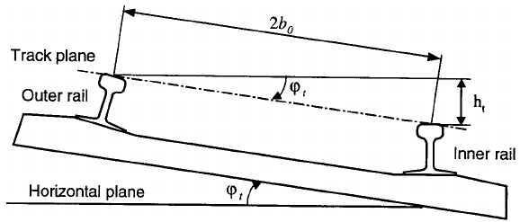

# Dataset description

|       Test Case title     | Code | Abbreviation | Author | Data Owner |
|:-------------------------:|:----:|:------------:|:------:| :---------:|
|  Aggregate structures + Track. Pavement and Course (ballast) + Cant | E2b1 | ASTPC | Evandro Alfieri | RFI |

## Dataset

- [Horizontal segments](#Horizontal-segments-csv)
- [Vertical segments](#Vertical-segments-csv)
- [Cant segments](#Cant-segments-csv)
- ...

---

### Horizontal segments csv
The meaning of the columns in the spreadsheet for the Horizontal Alignment is explained below (from left to right). **Please note** that *Spiral* is equal to *Clothoid* in the Point Type:

1. **Element type**:
    - Linear = straight line
    - Clothoid = transition curve used in Italy
    - Circular = arc curve
2. **Point Type** (start)
    - TS tangent to spiral 
    - SC spiral to curve 
    - CS curve to spiral 
    - ST spiral to tangent
    - SS spiral spiral
    - START starting point 
    - END ending point
3. **Station**: defines the point distance from the origin on the horizontal projection
4. **Start northing**: defines the start coordinate North
5. **Start easting**: defines the start coordinate East
6. **Start direction**: defines the Azimuth of the start point
7. **Point Type** (end): same as Point Type (start)
8. **End northing**: defines the end coordinate North
9. **End easting**: defines the end coordinate East
10. **End direction**: defines the Azimuth of the end point
11. **Length**: defines the length of the element (segment) on the horizontal projection
12. **Radius**: defines the Radius of the segment, only for “circular arc curve”

**NOTE**:
- All distances are in meters
- All angles are in gradian
- All the coordinates are defined using the UTM Coordinate System
- This case contains a reversing spiral [**TO BE CONFIRMED**]
- The radius is considered positive when the curve is to the right, and negative when it is to the left

#### Data snippet

---

### Vertical segments csv
The meaning of the columns in the spreadsheet for the Vertical Alignment is explained below (from left to right):

1. **Element type**:
    - Linear = straight line
    - Circular = arc curve
2. **Point Type** (start):
    - VPC Vertical point of curvature 
    - VPT Vertical point of tangency 
    - START point of beginning 
    - END point of ending
3. **Start Station**: defines the point distance from the origin, on the horizontal projection
4. **Start Elevation**: defines the start elevation:
5. **Start Gradient**: defines the Zenith angle of the start point
6. **Point Type** (end): same as Pont Type (start)
7. **End Station**: defines the point distance from the origin, on the horizontal projection
8. **End Elevation**: defines the end elevation:
9. **End Gradient**: defines the Zenith angle of the end point
10. **R**: defines the vertical circular radius of the segment.

**NOTE**:
- All distances are in meters
- All angles are in gradian
- The radius (**R**) is considered positive when the curve is convex, and negative when it is concave

#### Data snippet

___

### Cant segments csv
The meaning of the columns in the spreadsheet for the Cant Alignment is explained below (from left to right). **Please note** that *Spiral* is equal to *Clothoid* in the Point Type:

1. **Type**: is the type of point
    - TS tangent to spiral 
    - SC spiral to curve 
    - CS curve to spiral 
    - ST spiral to tangent
    - SS spiral spiral
    - START starting point 
    - END ending point
2. **Station**: defines the point distance from the origin, on the horizontal projection
3. **Speed**: parameter used to calculate cant (may be used used for validation)
4. **Radius**: the radius of the curve that, in the horizontal alignment, starts/ends in that station point
5. **Transition**: the type of transition curve that, in the horizontal alignment, stays between that station point and the next one
6. **Applied cant**: in a cross-section plane, orthogonal to the track axis, it is the difference in height (ht in the picture below) between two points, of the track plane, that have a conventional distance between them of 1500 mm. The cant is always applied to the external rail (the furthest rail from the center or the curve). Cant measure is positive because the external rail of a track is always higher than the internal rail.

**NOTE**:
- In Italy, only straight line is used for cant segment
- All distances are in meters, except the Cant that is in millimetres
- All angles are in gradian
- Speed is in kilometres per hour (km/h)
- The radius (**R**) is considered positive when the curve is to the right, and negative when it is to the left

#### Data snippet

